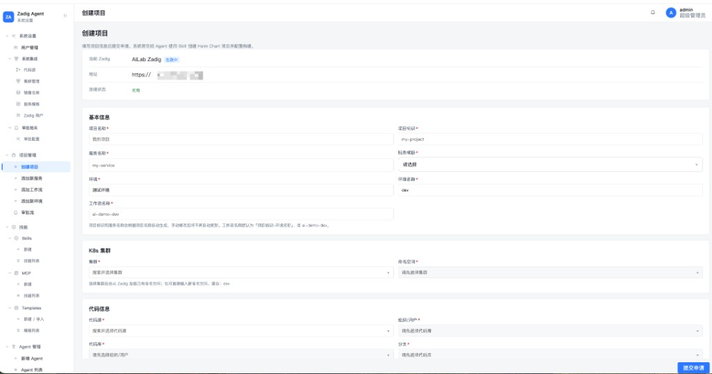
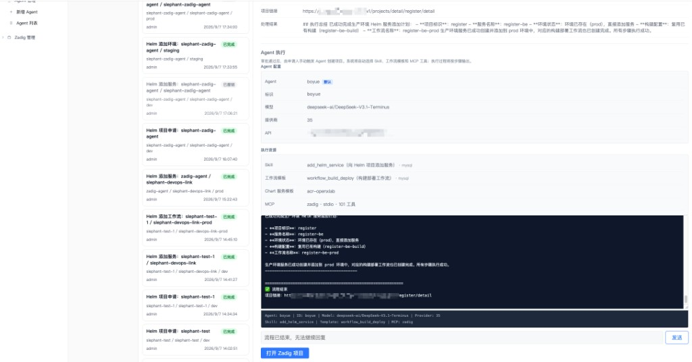

# zadig-agent

把 Zadig OpenAPI 封装成 MCP 工具，供 Cursor 或其他 Agent 调用。也包含一个本地 LangGraph Agent，以及基于 Web 的申请、审批与 Agent 执行平台。

默认 **stdio**（Cursor / 本机进程拉起）。需要外部 Agent 访问时，再开 **SSE**。

## 平台界面

Web 端提供 Helm 项目申请、添加服务、添加环境、添加工作流等表单，并与审批流、Agent 执行打通。用户在页面填写配置并提交申请，审批通过后由 Agent 自动调用 Zadig MCP 完成创建。

### 创建项目

支持填写基本信息、K8s 集群与命名空间、代码信息（代码源 / 组织 / 代码库 / 分支）、Values 文件、构建变量等；下拉框支持模糊搜索，代码库与分支走 Zadig 服务端检索。



### Agent 执行

审批通过后，平台按申请内容生成执行计划，由配置的 Agent 调用 Skill 与 MCP 工具在 Zadig 侧落地。执行过程可查看终端输出、处理结果摘要，并一键跳转 Zadig 项目页。



## 准备

Python 3.13+。

```bash
cd zadig-agent
python -m venv .venv
source .venv/bin/activate
pip install -e .
cp config.example.yaml config.yaml
```

`config.yaml` 只放基础设施：

- `mysql.*`：页面配置（Agent / Zadig / 新建技能）写入该数据库
- `server.*`：系统设置页 API 监听地址，默认 `127.0.0.1:8088`
- `mcp.*`：可选。不写则默认 `stdio` + `127.0.0.1:8000`

Agent、Zadig 连接和页面新建的技能在系统设置页维护，保存在 MySQL。

不要把 `config.yaml` 提交到仓库。

## 启动 MCP 服务器

优先级：命令行 > 环境变量 > `config.yaml` > 默认值。

### 本地 stdio（默认）

给 Cursor 或本仓库 Agent 用。**不要自己前台常驻**，客户端会按需拉起进程。

手动试跑（会占用标准输入，一般不用）：

```bash
.venv/bin/python zadig_mcp/server.py
# 或
.venv/bin/python zadig_mcp/server.py --transport stdio
```

stdio 模式下不要往 stdout 打日志，协议走标准输入输出。

### SSE（本机调试或公网）

```bash
.venv/bin/python zadig_mcp/server.py --transport sse --host 127.0.0.1 --port 8000
```

- 端点：`http://127.0.0.1:8000/sse`
- 健康检查：`http://127.0.0.1:8000/health`

绑定 `0.0.0.0` 等非本机地址时必须带 Token：

```bash
.venv/bin/python zadig_mcp/server.py \
  --transport sse \
  --host 0.0.0.0 \
  --port 8000 \
  --token '替换成足够长的随机串'
```

等价环境变量：`ZADIG_MCP_TRANSPORT`、`ZADIG_MCP_HOST`、`ZADIG_MCP_PORT`、`ZADIG_MCP_TOKEN`。

也可写在 `config.yaml`：

```yaml
mcp:
  transport: sse
  host: 0.0.0.0
  port: 8000
  token: "替换成足够长的随机串"
```

## Cursor 加载

### 方式 A：本地 stdio（推荐）

编辑 `~/.cursor/mcp.json`（全局）或项目 `.cursor/mcp.json`：

```json
{
  "mcpServers": {
    "zadig": {
      "command": "/Users/Zhuanz/projects/zadig-agent/.venv/bin/python",
      "args": [
        "/Users/Zhuanz/projects/zadig-agent/zadig_mcp/server.py"
      ]
    }
  }
}
```

`command` / `args` 换成你机器上的绝对路径。保存后执行 **Developer: Reload Window**，到 **Settings → MCP** 确认 `zadig` 已连接。

### 方式 B：远程 / 公网 SSE

先按上一节启动 SSE，再配：

```json
{
  "mcpServers": {
    "zadig": {
      "type": "sse",
      "url": "https://你的域名/sse",
      "headers": {
        "Authorization": "Bearer 你的Token"
      }
    }
  }
}
```

本机未开鉴权时，可先用 `http://127.0.0.1:8000/sse`，且不要加 `headers`。

## 公网暴露给外部 Agent

stdio 不能被外网访问。流程：本机 SSE → HTTPS 反代或隧道 → 客户端填 URL。

1. 本机监听并开启 Token：

   ```bash
   ZADIG_MCP_TOKEN='替换成足够长的随机串' \
   .venv/bin/python zadig_mcp/server.py --transport sse --host 127.0.0.1 --port 8000
   ```

2. 挂到公网（任选）：

   - 快速试用：`cloudflared tunnel --url http://127.0.0.1:8000` 或 ngrok
   - 正式环境：Nginx / Caddy 反代到 `127.0.0.1:8000`，只开放 443

3. 外部 Cursor / Agent 使用：

   ```json
   {
     "mcpServers": {
       "zadig": {
         "type": "sse",
         "url": "https://你的域名/sse",
         "headers": {
           "Authorization": "Bearer 你的Token"
         }
       }
     }
   }
   ```

这些工具能改 Zadig 项目、环境和流水线。公网必须 HTTPS + Bearer Token，不要把 Token 或 `config.yaml` 写进仓库。

## 系统设置页（React）

从 Zadig 同步代码源、集群、镜像仓库和用户，布局对照系统集成页。

```bash
# 后端 API，监听地址读 config.yaml 的 server，默认 http://127.0.0.1:8088
.venv/bin/python -m webapi

# 前端，默认 http://127.0.0.1:5173
cd web && npm install && npm run dev
```

浏览器打开 `http://127.0.0.1:5173`。界面与能力概览见上文 [平台界面](#平台界面)。

**使用者文档**：[docs/USER_GUIDE.md](docs/USER_GUIDE.md)（创建项目、添加服务/环境/工作流、审批与 Agent 执行说明）

- **项目管理**：创建项目、添加服务、添加环境、添加工作流（表单 + 审批 + Agent 执行）
- 系统设置 → 系统集成：从 Zadig 同步代码源、集群、镜像仓库、用户
- 技能 → Skills：仓库示例 + 页面新建（写入 MySQL）
- 技能 → MCP：内置工具 + 页面新建的 MCP 技能（写入 MySQL）
- Agent 管理：在页面配置多个模型（api_key / model / base_url），设置默认项；默认不可用时随机切到其他可连通备份
- Zadig 管理：在页面配置 base_url、api_token，并查看连通状态

所有列表支持分页，并可选择每页 10 / 20 / 50 / 100 条。

页面配置写入 MySQL；`config.yaml` 不要提交到仓库。

## 本地 LangGraph Agent

读页面维护的 Agent / Zadig 配置，通过 stdio 拉起同一套 MCP 工具：

```bash
.venv/bin/python agent/zadig_agent.py
```

输入 `exit` 结束。

## 工具覆盖

统一服务器会注册项目、环境、服务、构建、工作流、集群、镜像仓库、模板、权限、用户、系统日志、协作模式等 OpenAPI 能力。单域文件仍可单独调试，例如：

```bash
.venv/bin/python zadig_mcp/workflows_tools.py
```
